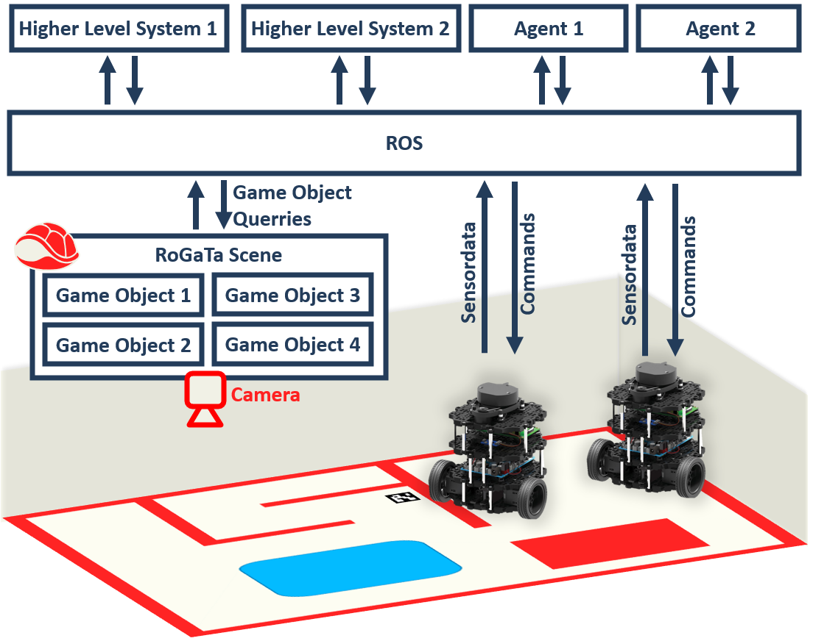
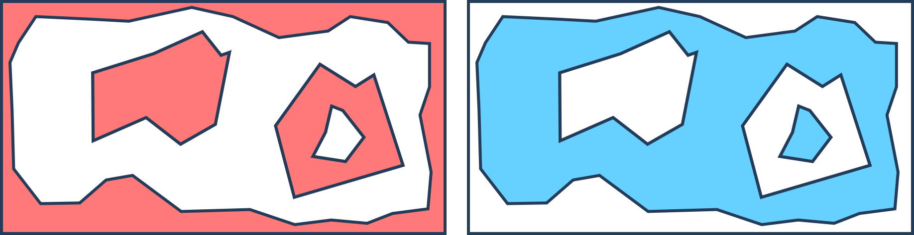

How it Works
************

.. toctree::
   :hidden:

The RoGaTa engine defines game objects by detecting and tracking their position using a camera affixed over the game area.
To make it quick and easy to setup a game area this is achieved using a mixture of marker based tracking and color based detection.

The game objects are are managed by scenes.
Scenes are ROS Nodes that provide service interfaces which allow interaction with the game objects.
The services of a scene can be called by other ROS nodes in order to either build higher level systems systems or provide an agent controlling a robot with additional information.
For example querrying the position of a game object called 'cheese' can be performed using the following codesnippet:
::

    import rogata_library as rgt
    rogata = rgt.rogata_helper()
    cheese_pos = rogata.get_pos("cheese")

This code uses the rogata_helper class which abstracts the ROS communication.
The section about Scenes explains how to directly call the different services the RoGaTa engine offers.
A schematic view of the communication can be seen here:

In this example there are two ROS enabled robots in the game area.
These also share their sensor information and accept commands via ROS interfaces.
The rest of this page will go into more detail about how to build game objects and scenes.
It will also explain how the RoGaTa engine can be used to interact with these objects to build higher level systems for more complex games or control robots.

Game Objects
===========
Game Objects are the basic building blocks of the engine.
Examples of game objects include:
 * robots
 * movable obstacles
 * Areas
 * Buttons
 * Walls

In general, such an object is defined by a name as well as the space it occupies within the game area.
The simplest way to define an area is using a mask that specifies for each position whether the point is inside or outside the area.
In robotics, such a concept is sometimes also called an occupancenter_ygrid.
However, since storing and manipulating such grids is resource-intensive.
For this reason, only the borders of an object are used to define its area.

However, borders alone are not enough to fully define an object, since for more complex objects it is not clear what is defined as inside and outside.
This can be illustrated in the following image:

To make the area definition unambiguous, a hierarchy can be introduced.
The outermost border of an object has a hierarchy of 1, if it has a corresponding inner border it has a hierarchy of -1.
Since more complex objects might have another outside border inside an inner border, these are denoted by a hierarchy of 2.
The general definition is as follows:
 1. Outer borders are denoted by positive numbers a
 2. The inner border corresponding to an outer border has a hierarchy of -a
 3. The hierarchy a is equal to 1+b where b is the hierarchy of the smallest border surrounding the considered border

An example can be seen in the following image:

.. image:: hierachy

Using the border, which is specified as an opencv contour object as well as a name and a hierarchy a game object can be initialized.
Its documentation can be seen in :py:class:`rogata_library.GameObject`.

Interacting with a Game Object
------------------------------
There are multiple ways to interact with Game Objects.
Since contrary to conventional game engines, graphic rendering and physics simulation is not needed, these focus mostly on detecting collisions and ray casting.

A full overview of the functionality can be seen in :py:class:`rogata_library.GameObject`.

Dynamic Game Objects
--------------------
Dynamic Game Objects are a subclass of Game objects.
They differ slightly in their initialization since they also keep track of a marker ID which the engine uses to update their position.
Their contour is also built automatically using the specifications of a hitbox.

Currently, only rectangular hitboxes are supported.

Scenes
======
Scenes are the equivalent of video game levels.
A scene defines which game objects are currently loaded and offers the functionality to interact with them.
As such it is initialized using a list of :py:class:`rogata_library.GameObject`.

Using the objects, a scene offers several ROS communication schemes that allow other nodes to interact with the game objects.
These include the following `ROS services <http://wiki.ros.org/Services>`_:

set_position
^^^^^^^^^^^^
This service allows any ROS node to change the position of a GameObject by providing the desired object's name ``NAME`` and a new position ``POS``.
In python the service can be set up and called using:
::

    # Set up
    from rogata_engine.srv import *

    set_position = rospy.ServiceProxy('set_position',SetPos)

    # Calling the service
    req          = SetosRequest(NAME,POS[0],POS[1])
    resp         = set_position(req)

Its returned response is a ROS service message containing a boolean value which can be called using:
::

    resp.sucess

intersect_line
^^^^^^^^^^^^^^
This service allows any ROS node to calculate the intersection of a line with starting point ``START``, direction ``THETA``  and length ``LENGTH`` and a desired object with name ``NAME``.
In python the service can be set up and called using:
::

    # Set up
    from rogata_engine.srv import *
    from geometry_msgs.msg import Pose2D

    intersect = rospy.ServiceProxy('intersect_line',RequestInter)

    # Calling the service
    line      = Pose2D(START[0],START[1],THETA)
    req       = RequestInterRequest(GameObject,line,length)
    resp      = intersect(req)

Its returned response is a ROS service message containing the position of the intersection. This intersection can be extracted using:
::

    import numpy as np
    INTERSECTION_POINT=np.array([resp.x,resp.y])

get_distance
^^^^^^^^^^^^
This service allows any ROS node to get the shortest distance between a point ``POINT`` and the border of an object with name ``NAME``
.. warning::
    Note that this means the distance is positive even if the point is inside the object!

In python the service can be set up and called using:
::

    # Set up
    from rogata_engine.srv import *
    get_distance = rospy.ServiceProxy('get_distance',RequestDist)

    # Calling the service
    req          = RequestDistRequest(NAME,POINT[0],POINT[1])
    resp         = get_distance(req)

It returns a ROS service message containing the distance. This distance can be extracted using:
::

   resp.distance

check_inside
^^^^^^^^^^^^
This service allows any ROS node to check whether a given point ``POINT`` is inside a object with name ``NAME``
In python the service can be set up and called using:
::

    # Set up
    from rogata_engine.srv import *
    check_inside   = rospy.ServiceProxy('check_inside',CheckInside)

    # Calling the Service
    req            = CheckInsideRequest(NAME,POINT[0],POINT[1])
    resp           = check_inside(req)

It returns a ROS service message containing a boolean value which is 1 if the value is inside.
It can be extracted using:
::

    resp.inside

.. note::
   The ROS communication interface is very versatile and allows the engine to interface not only with Python scripts but also C++ programs.
   However, it is also a bit cumbersome to use.
   For this reason, the :py:class:`rogata_library.rogata_helper` class can be initialized at the start of any python script. It directly implements the service setup and abstracts it using simple class functions

.. warning::
   Be carefull using the same instance of :py:class:`rogata_library.rogata_helper` in multiple callbacks or other parallel constructs, this can lead to the programm getting stuck. This happens because the same service is called from the same instance twice and thus only one will receive an answer.
   Since rospy has no timeout for services this will result in the service being stuck forever.

