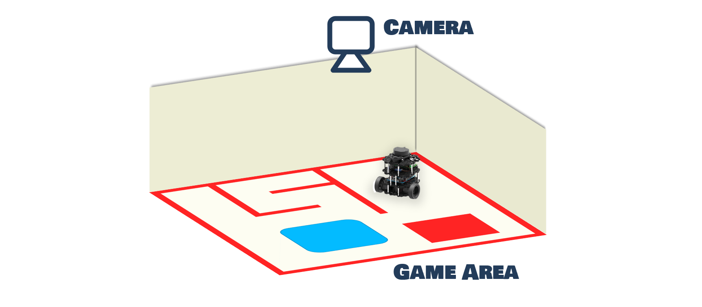

How it Works
************

.. toctree::
   :hidden:
   

The RoGaTa engine defines game objects by detecting and tracking their position using a camera afixed over the game area.

The main consideration when choosing an object detection scheme for the engine is the ability to quickly setup the game area and initialize the game objects.
For this reason a mixture of marker based tracking and color based detection was used.
Before explaining in detail how the tracking is performed, one first has to define what exactly needs to be tracked.
For this reason the next section will introduce how a game object is defined.

Game Objects
===========
Game Objects are the basic building blocks of the engine.
Examples of game objects include:
 * robots
 * movable obstacles
 * Areas
 * Buttons
 * Walls

In general such an object is defined by a name aswell as the space it occupies within the game area.
The simplest way to define an area is using a mask witch specifies for each position wheter the point is inside or outside the area.
In robotics such a concept is sometimes also called an occupancy grid.
However since storing and manipulating such grids is resource intensive.
For this reason only the borders of an object are used to define its area.

However borders alone are not enough to fully define an object, since for more complex objects it is not clear what is defined as inside and outside.
This can be illustrated in the following image:

.. image:: complex_object.png

To make the area definition unambiguous, a hierachy can be introduced.
The outermost border of an object has a hieracy of 1, if it has a corresponding inner border it has a hierachy of -1.
Since more complex objects might have another outside border inside a inner border, these are denoted by a hierachy of 2.
The general defintion is as follows:
 1. Outer borders are denoted by positive numbers a
 2. The inner border corresponding to a outer border has a hierachy of -a
 3. The hierachy a is equal to 1+b where b is the hierachy of the smallest border surrounding the considered border

A example can be seen in the following image:

.. image:: hierachy

Using the border, which is specified as a opencv contour object aswell as a name and a hierachy a game object can be initialized.
Its documentation can be seen in :py:class:`rogata_library.game_object`.

Interacting with a Game Object
------------------------------
There are mutliple ways to interact with Game Objects.
Since contrary to conventional game engines, graphic rendering and physics simulation is not needet, these focus mostly on detecting collisions and ray casting.

A full overview of the functionality can be seen in :py:class:`rogata_library.game_object`.

Dynamic Game Objects
--------------------
Dynamic Game Objects are a subclass of Game objects.
They differ slightly in their initialisation sice they also keep track of a marker ID which the engine uses to update their position.
Their contour is also build automatically using a the specifications of a hitbox.

Currently only rectangular hitboxes are supported.

Scenes
======
Scenes are the equivalent of  video game levels.
A scene defines which game objects are currently loaded and offers the functionality to interact with them.
As such it is initalized using a list of  :py:class:`rogata_library.game_object`.

Using the objects, a scene offers a number of ROS communication schemes that allow other nodes to interact with the game objects.
These include the following `ROS services <http://wiki.ros.org/Services>`_:

set_position
^^^^^^^^^^^^
This services allows any ROS node to change the position of a game_object by providing the desired objects name ``NAME`` and a new position ``POS``.
In python the service can be set up and called using:
::
    
    # Set up
    from rogata_engine.srv import * 

    set_position = rospy.ServiceProxy('set_position',SetPos)

    # Calling the service
    req          = SetosRequest(NAME,POS[0],POS[1])
    resp         = set_position(req) 

Its returned response is a ROS service message containing a boolean value which can be called using:
::
    
    resp.sucess

intersect_line
^^^^^^^^^^^^^^
This service allows any ROS node to calculate the intersection of a line with starting point ``START``, direction ``THETA``  and length ``LENGTH`` and a desired object with name ``NAME``.
In python the service can be set up and called using:
::
    

    # Set up
    from rogata_engine.srv import * 
    from geometry_msgs.msg import Pose2D

    intersect = rospy.ServiceProxy('intersect_line',RequestInter)

    # Calling the service
    line      = Pose2D(START[0],START[1],THETA)
    req       = RequestInterRequest(game_object,line,length)
    resp      = intersect(req)

Its returned response is a ROS service message containing the position of the intersection. This intersection can be extracted using:
::

    INTERSECTION_POINT=np.array([resp.x,resp.y])

get_distance
^^^^^^^^^^^^
This service allows any ROS node to get the shortest distance between a point ``POINT`` and the border of an object with name ``NAME``
.. warning::
    Note that this means the distance is positive even if the point is inside the object!

In python the service can be set up and called using:
::

    # Set up
    from rogata_engine.srv import *
    get_distance = rospy.ServiceProxy('get_distance',RequestDist)

    # Calling the service
    req          = RequestDistRequest(NAME,POINT[0],POINT[1])
    resp         = get_distance(req)

It returns a ROS service message containing the distance. This distance can be extracted using:
::

   resp.distance 

check_inside
^^^^^^^^^^^^
This service allows any ROS node to check wheter a given point ``POINT`` is inside a object with name ``NAME``
In python the service can be set up and called using:
::
    
    # Set up
    from rogata_engine.srv import *
    check_inside   = rospy.ServiceProxy('check_inside',CheckInside)

    # Calling the Service
    req            = CheckInsideRequest(NAME,POINT[0],POINT[1])
    resp           = check_inside(req)

It returns a ROS service message containing a boolean value which is 1 if the value is inside.
It can be extracted using:
::

    resp.inside

.. note::
   The ROS communication interface is very versatile and allows the engine to interface not only with Python scripts but als C++ programms.
   However it is also a bit cumbersome to use.
   For this reason the :py:class:`rogata_library.rogata_helper` class can be initialized at the start of any python script. It directly implements the service setup and abstracts it using simple class functions 

