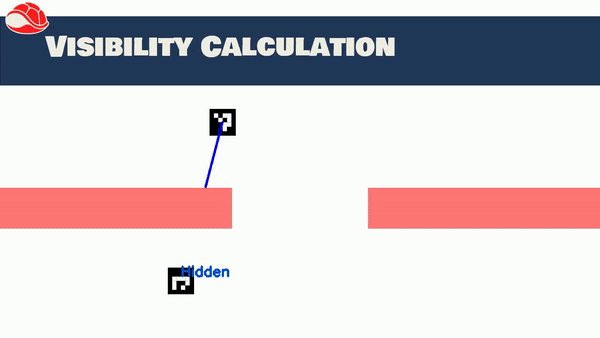
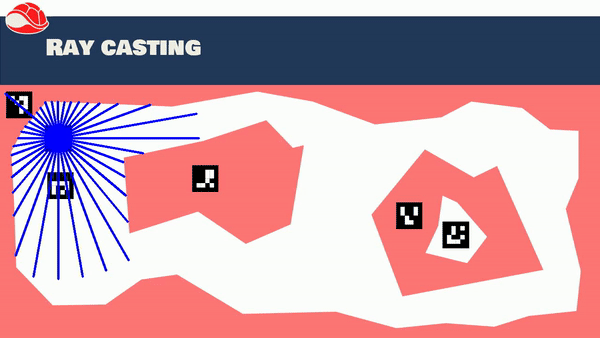

Tutorials
************

.. toctree::
   :hidden:
   

Simple Scoreboards
==================

Scoreboards a staple of Video games, defining what constitutes good play.
In terms of machine learning, they also have uses for calculating an agent's fitness.

This simple tutorial will give an example of how to implement such a scoreboard.
It will assume that the game scene is already set up and can be accessed.
For this example, the scene will include several coins that the player needs to collect.
Since each coin is independent of the rest, each coin is its own game objects and will follow the naming convention 
``coin/i`` where ``i`` is an integer smaller or equal to 12.

The complete Scoreboard code now looks like this:
::
    
    #!/usr/bin/env python
    import numpy as np
    import rogata_library as rgt
    from rogata_engine.srv import *
    import rospy

    class coin_scoreboard():

        def __init__(self,player_list,coin_name,coin_number):
            self.player_list = player_list
            self.coin_name   = coin_name
            self.coin_number = coin_number
            self.collection  = {}

            self.check_inside   = rospy.ServiceProxy('check_inside',CheckInside)

            for players in player_list:
                self.collection[players] = np.zeros(self.coin_number)
                rospy.Subscriber(players+"/odom",self.manage_score,players)

            rospy.spin()

        def manage_score(self,data,player):
            point = np.array([data.pose.pose.position.x,data.pose.pose.position.x])
            already_collected = self.collection[player]
            for i in range(self.coin_number):
                req  = CheckInsideRequest("coint/"+str(i),point[0],point[1])
                resp = self.check_inside(req)

                already_collected[i] = already_collected[i] or resp.inside

            self.collection[player] = already_collected
            rospy.set_param(player+"/score",np.sum(already_collected))

    if __name__ = "__main__":
        rospy.init_node("score_board")
        score = coin_scoreboard(["player_1","player_2"],"coin",12)

This code might seem complex, the following sections will therefore break it down line by line.
The first question one might ask beforehand is why a class is needed to implement this scoreboard.
The reason for this is that it is not trivial to store information from a subscriber outside its `callback function <http://wiki.ros.org/ROS/Tutorials/WritingPublisherSubscriber%28python%29>`_.
Class variables are simply a convenient way to circumvent this problem.

Getting back to the code, the line
::
    
    #!/usr/bin/env python

Is needed for every Python ROS Node. This first line makes sure that the script is executed with Python.
::

    import numpy as np
    import rogata_library as rgt
    from rogata_engine.srv import *
    from nav_msgs.msg import Pose2D
    import rospy

These lines declare the needed libraries and modules. Numpy offers convenient array math functions and rospy the ROS interface. ``rogata_engine.srv`` and ``Pose2D`` are needed to import the `ROS service <http://wiki.ros.org/ROS/Tutorials/WritingServiceClient%28python%29>`_ objects needed to call the RoGaTa engine services.
::

        def __init__(self,player_list,coin_name,coin_number):
            self.player_list = player_list
            self.coin_name   = coin_name
            self.coin_number = coin_number
            self.collection  = {}

            self.check_inside   = rospy.ServiceProxy('check_inside',CheckInside)

            for players in player_list:
                self.collection[players] = np.zeros(self.coin_number)
                rospy.Subscriber(players+"/odom",Pose2D,self.manage_score,players)

            rospy.spin()

The ``__init__`` function initializes the class. In this case, this requires a list of player names, the name of the coin object, and the coin number.
The last two arguments could also have been hardcoded, but are provided here as inputs to make the class more flexible.
The function also initializes the dictionary ``self.collection`` which keeps track of which coins have already been collected by a given player.
It is populated inside the foor loop.
Here also a `Subscriber <http://wiki.ros.org/ROS/Tutorials/WritingPublisherSubscriber%28python%29>`_ is set up for each player which reads in the position of each player.
For this to work, the names of the players have to refer to dynamic objects initialized in a :py:class:`rogata_library.scene` object.

Additionally a service ``self.check_inside`` is set up to request information from the engine whether a given point is inside an object.
This will later be used to check whether a player has collected a ``coin``.

Lastly ``rospy.spin()`` is called, which ensures that the system stays active and does not immediately terminate.
::

        def manage_score(self,data,player):
            point = np.array([data.pose.pose.position.x,data.pose.pose.position.x])
            already_collected = self.collection[player]
            for i in range(self.coin_number):
                req  = CheckInsideRequest("coint/"+str(i),point[0],point[1])
                resp = self.check_inside(req)

                already_collected[i] = already_collected[i] or resp.inside

            self.collection[player] = already_collected
            rospy.set_param(player+"/score",np.sum(already_collected))

The ``manage_score`` function is the callback of the position subscriber. This means it gets called every time the position of the dynamic objects is updated.
The returned argument ``data`` is of type ``Pose2D`` and first has to be converted to a point.
Using the current position of a player, the list of collected coins can now be updated. For each coin, the foor loop calls the ``self.check_inside`` service to check if a new coin has been collected.
The sum of all collected coins is lastly set as a `ROS parameter <http://wiki.ros.org/Parameter%20Server>`_ 
This allows any other ROS node to check the score of a given player with the name ``PLAYERNAME`` by calling
::

    rospy.get_param(PLAYERNAME/score)

Simple Line of Sight Calculation
================================
Another Common Problem is line of sight calculation.
While robots can do line of sight calculation with an onboard camera this requires object detection.
The RoGaTa engine, allows circumventing these requirements by using line intersection.
This allows the design of stealth-like games where a ``thief`` has to enter an area undetected by one or more ``guards``.
To calculate whether a ``guard`` can see a ``thief`` the following function can be used:
::

    import numpy as np
    import rogata_library as rgt

    rogata = rgt.rogata_helper()

    def visibility(guard,thief,wall_objects,max_seeing_distance):
        distance   = np.linalg.norm(thief-guard)
        direction  = (thief-guard)/distance
        direction  = np.arctan2(direction[1],direction[0])

        min_intersect = guard + max_seeing_distance * np.array([np.cos(direction),np.sin(direction)])

        for walls in wall_objects:

            intersection = rogata.intersect(walls,guard,direction,max_seeing_distance)
            if np.linalg.norm(intersection-guard) <= np.linalg.norm(min_intersect-guard):
                min_intersect = intersection

        if np.linalg.norm(min_intersect-guard) >= distance:
            return 1
        else:
            return 0

Here the ``rogata_helper`` class is used to abstract the ``get_intersection`` service of the engine.
The Function defines a line between ``guard`` and ``thief`` and checks if this line is intersected by an object that is not see-through.
Since multiple such ``walls`` could exist, the system accepts a list called ``wall_objects``.
If there is an intersection between the ``guard`` and the ``thief`` the line of sight is broken and the function returns ``False``.
Otherwise, the two see each other and the function returns ``True``.

A visualization of the algorithm can be seen here:

Ray Casting
===========

A laser scanner is a common tool for mobile robots that enables the use of SLAM algorithms and general navigation.
However to use such algorithms one has to build up physical walls.
Additionally, some robots may not have such sensors.

In both cases, it might be beneficial to simulate a laser scanner that interacts with game objects.
This can be done using the ray casting functionality the engine provides.
A simple example of such a code can be seen here:
::

    def laser_scanner(object_list,test_point,angles):
        scan = np.zeros((len(angles),2))
        for i in angles:
            end_point = np.array([100000,100000])
            for k in range(len(objects)):
                line      = Pose2D(test_point[0],test_point[1],i)
                name=String()
                name.data = objects[k]
                req       = RequestInterRequest(str(objects[k]),line,length)
                response  = inters(req)
                new_point = np.array([response.x,response.y])

                if np.linalg.norm(new_point-test_point) <= np.linalg.norm(end_point-test_point):
                    end_point = new_point

            scan[i,:] = end_point 

Where ``object_list`` is a list containing the names of the objects with which the laser scanner should intersect and ``angles`` a list of directions in which the laser scanner measures its distance. This direction is provided using an angle in radians convention.

.. warning::
   Since a ray is cast out for each object to intersect with, the speed of the function scales with the number of objects.
   For this reason, all walls should be defined in as few objects as possible to preserve performance.

Lastly ``test_point`` is the origin of the laser scanner in the game area.
The result of the function is visualized in the following function, where an angle range in 10-degree increments was chosen.

.. note::
   The Stray blue line in the left top corner is an artifact of suboptimal marker placement with meant that the contour of the outside wall goes around the marker.

Changing the Robots Dynamics
============================
The Purpose of a game engine is of course not only to observe the movement of robots, but also to influence it.
The simplest use case is to change the dynamics of a robot depending on which area it is in.
This might mean slowing down the robot when he goes off a `track`, or making him unable to turn while on `ice`.

In both cases, this is achieved by writing a dynamics node that offers a fake command velocity subscriber and which then publishes to the ``cmd_vel`` topic of the robot.
