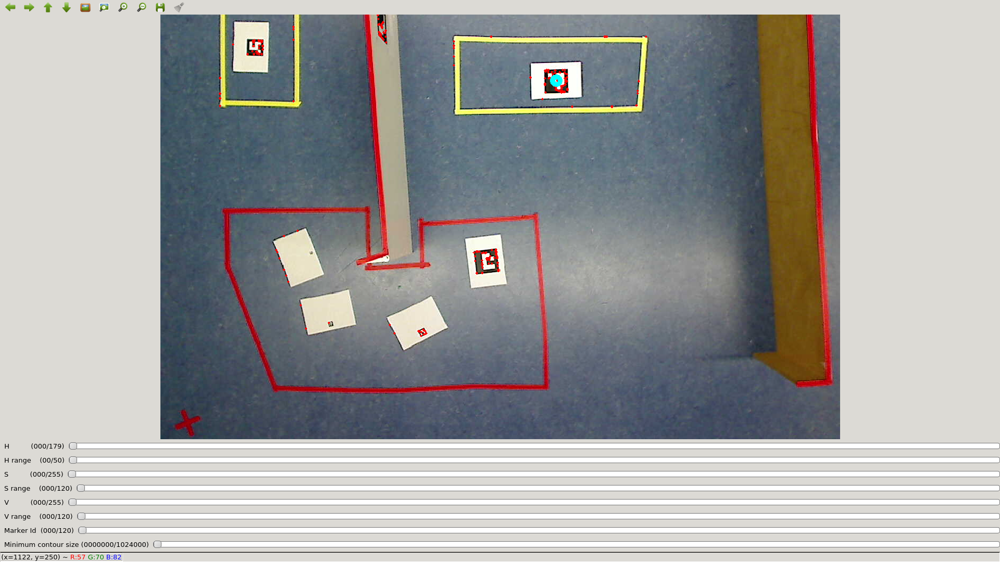
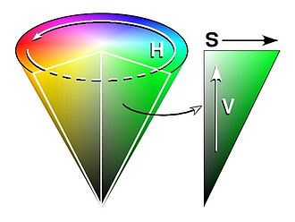
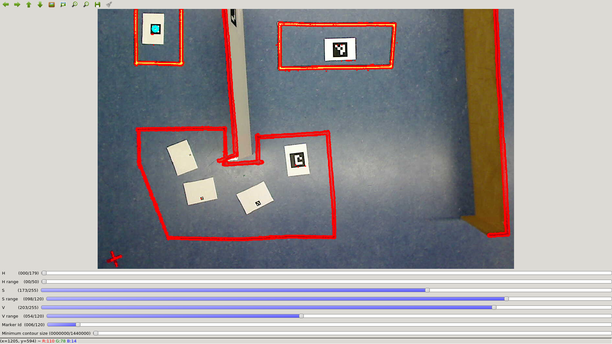
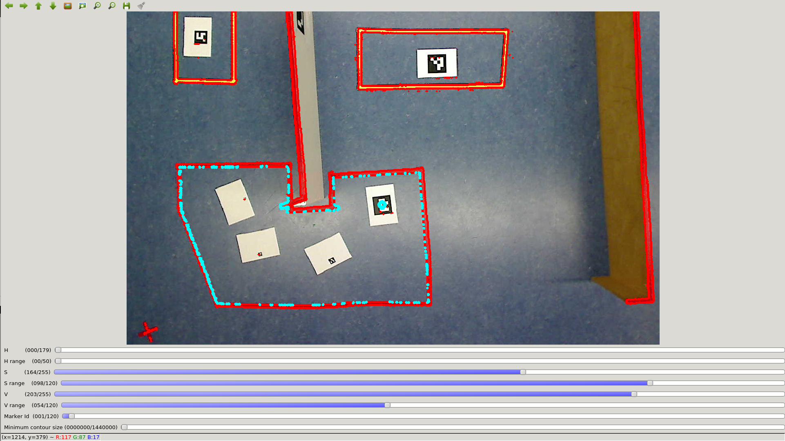
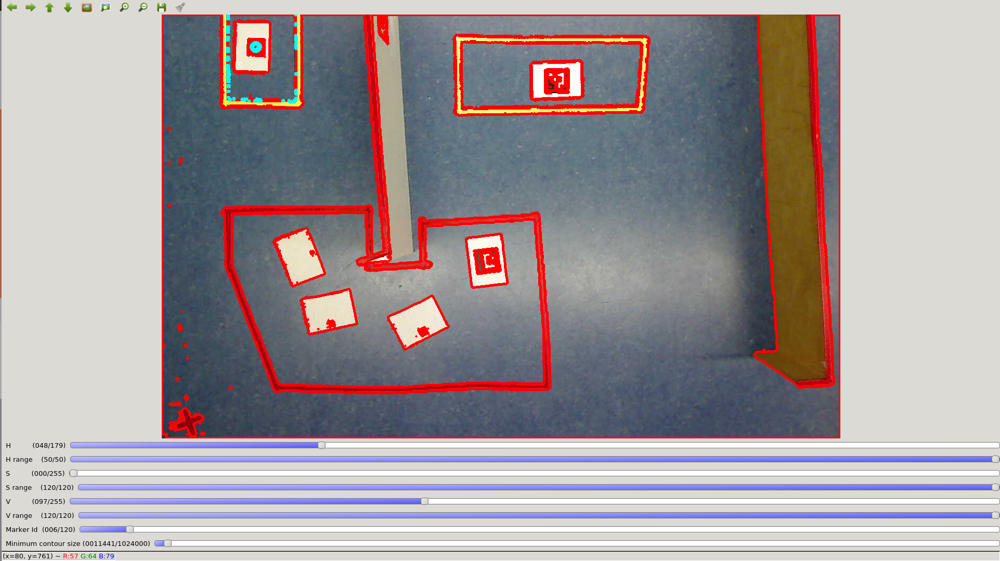
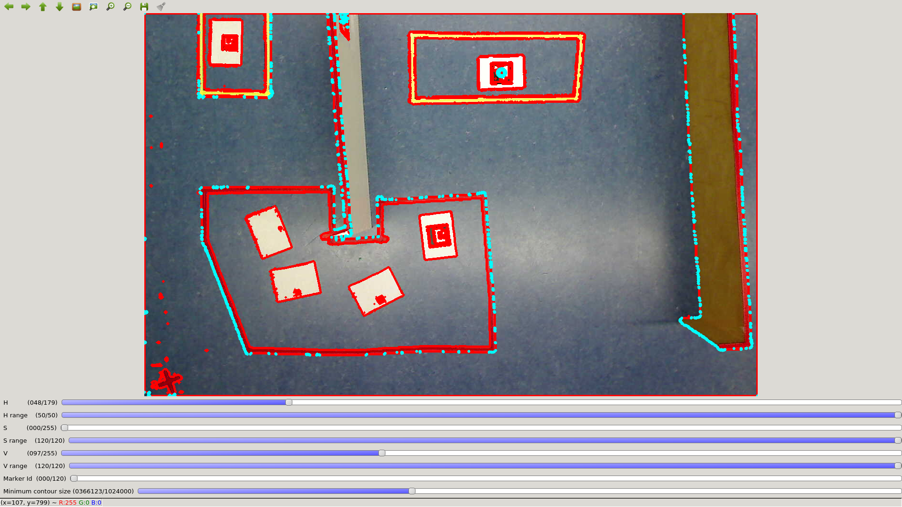

Getting Started
***************

.. toctree::
   :hidden:
   

The RoGaTa engine build upon `Ros Melodic`_ to interface with the robots, and `OpenCV-Python`_ to calibrate the arena and track all dynamic objects.
The first step is thus to install ROS on all robots as well as the host PC. 

The host PC refers in this case to the PC which runs the engine which means that additonally OpenCV has to be installed there.

.. _Ros Melodic: http://wiki.ros.org/melodic
.. _OpenCV-Python: https://docs.opencv.org/master/da/df6/tutorial_py_table_of_contents_setup.html

Setting up the Enviroment
=========================
Once ROS and OpenCV are installed the environment of the engine has to be set up.
First a catkin workspace has to be created.
For this `catkin tutorial`_ can be followed.

The RoGaTa Engine itself is a ROS package containing nodes for camera based sensing and a library that provides utilities for game development.
The package has to be placed inside the ``catkin_ws/src`` directory::

    cd ~/catkin_ws/src
    git clone https://github.com/liquidcronos/RoGaTa-Engine

Afterward the ``catkin_make`` command has to be called inside the ``catkin_ws`` directory::

    cd ..
    catkin_make

If everything is correctly installed, the following command should change the current directory to the one containing the ROS package::

    roscd rogata_engine

.. _catkin tutorial: http://wiki.ros.org/catkin/Tutorials/create_a_workspace

Setting up the Game Area
========================

Setting up a Scene
==================
Scenes can be thought of as real life video game levels.
A Scene is made up of multiple game objects whose position is determined by a camera above the physical level.
Setting up a scene thus simply means getting the engine to recognize phyiscal objects as game objects.

The RoGaTa engine uses a simple recognition based on an objects color.
The full theory behind the detection of game objects can be seen in `How it Works`_.

Calibrating the Arena
---------------------

To calibrate the arena the calibrate_scene.py script can be used.
It is called using:
::

    python calibrate_scene.py PATH_TO_IMAGE

Where ``PATH_TO_IMAGE`` is the path to an image of the scene.
This image has to be captured with the same **stationary** camera used to later track dynamic objects.
The script will open a window where one can see the image of the scene as well as a number of sliders:

The first six sliders are used to select the color of the desired object.
This color is specified in the HSV colorspace.
HSV refers to Hue, Saturation and Value.
A good visualisation of the HSV values can be seen in this image from its `wikipedia page <https://en.wikipedia.org/wiki/HSL_and_HSV>`_:

For OpenCV, The Hue Range goes from 0-179 (which is half that of the common Hue definition which goes from 0 to 359). since the Hue value is cyclical, both these values represent a type of red.
While the borders between colors is not clearly defined the following table with give an idea which hue values to pick for each object color

+--------+-----------------+
|Color   | Hue Value Range |
+========+=================+
|Red     | 0-30            |
+--------+-----------------+
|Yellow  | 31-60           |
+--------+-----------------+
|Green   | 61-90           |
+--------+-----------------+
|Cyan    | 91-120          |
+--------+-----------------+
|Blue    | 121-150         |
+--------+-----------------+
|Mageta  | 151-179         |
+--------+-----------------+

Saturation and Value are defined from 0-255.
The less saturated an image, the less colorfull it is.
Additionally the lower its value, the darker it is.

Due to different lighting conditions acroos the scene these last two values will vary for an object.
For this reason each object also has a range slider.
Each range `d`  specifies a acceptable color intervall of `[VALUE-0.5d, VALUE+0.5d]`
Where `VALUE` is the value of the main slider.

.. note::
   For fast tuning it is advisable to first select the desrired hue value while setting the saturation and value ranges to maximum.
   From there it is easy to dial in the values until the desired object is selected.

Example values for the sliders can be seen in the following image:

As one can see there are multiple objects outlined in red.
To pick the desired object to track, aruco markers are used.
If placed inside the desired object, the contour can be selected by specifing the corresponding marker ID using the Marker ID slider.

.. note::
   It is possible to directly specifing values by clicking on the slider values on the left

Selecting Marker 1 results in the following image:

the currently selected contour is now highlighted in torquies.
It can now be saved by pressing `s` on the keyboard.
The Terminal in which the `calibrate_scene.py` script was called will now ask for a file name.
If provided it saves the contour as a `.npy` object.

This procedure can now be repeated for each contour.

If there are very small objects inside the scene such as walls or open contours such as the yellow one in the top left a trick can be emploxed.
Instead of using the color of the object, the color of the Ground can be used. 
This specifies a contour around the desired object which can then be selected.

However, in this case the border of the marker itself might count as a contour. To circumvent this the Minimum Contour Size slider can be used to specify the minimal size of the choosen contour.
This way it is poosible to select such open object:

However this trick might also select other game objects such as seen here when specifiny the contour of the wall:

This can be circumvented by first setting up the walls and using an image of the arena with out the other objects.

Building Game Objects
---------------------
Using the contours calibrated in the last section it is possible to set up game objects.

Building a Scene
----------------

